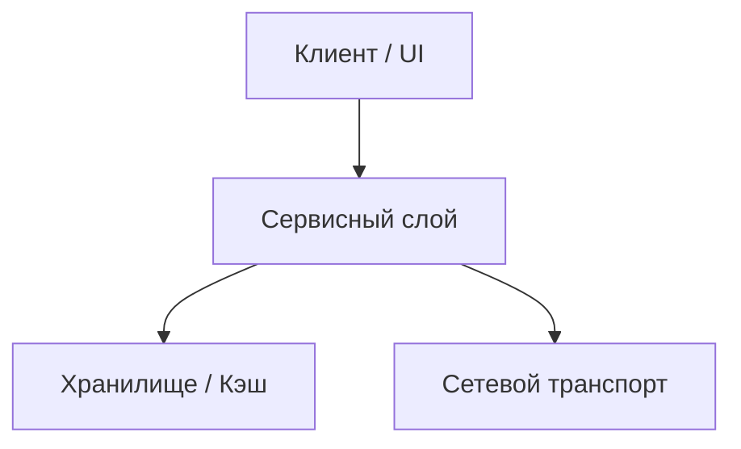

# 🏛️ Архитектура: [Название подсистемы / компонента]

> **Статус:** Активно  
> **Родительский индекс:** [[../00_Index|00_Index]]  
> **Теги:** #architecture #component  

---

## 1. Назначение и ответственность
*За какие бизнес- и технические функции отвечает данный компонент? Какие функции намеренно исключены из его зоны ответственности?*

## 2. Диаграмма взаимодействия

## 3. Ключевые интерфейсы и контракты
*Основные классы, интерфейсы, DTO и сигнатуры.*

## 4. Обработка ошибок и устойчивость (Fault Tolerance)
*Политика перезапуска, таймауты, fallback-сценарии при отказе зависимостей.*
