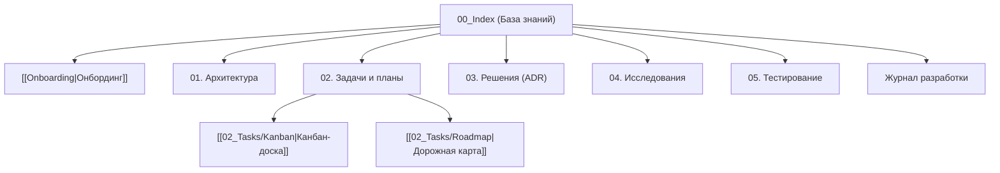

# 🧠 База знаний: [Название Проекта]

> **Теги:** #project #pkm #index  
> **Главная спецификация:** [[../SPEC|SPEC.md (Master Specification)]]  
> **Руководство по онбордингу:** [[Onboarding|Руководство разработчика]]  

Добро пожаловать в базу знаний проекта. Каталог `docs/` спроектирован для работы в **Obsidian** (как Vault) и в любых редакторах кода по стандарту **Docs-as-Code**.

---

## 🗺️ Карта заметок (Map of Content)

---

## 📂 Структура разделов

### 0. Вводные материалы
* [[Onboarding|Руководство по онбордингу]] — правила ведения базы знаний, 3 режима и команды.
* [[00_Templates/TEMPLATE_TASK|Каталог шаблонов]] — эталонные заготовки для всех типов документов.

### 1. Архитектура (`01_Architecture/`)
* Системные компоненты, схемы взаимодействия, сетевые протоколы.

### 2. Задачи и трекинг (`02_Tasks/`)
* [[02_Tasks/Kanban|Канбан-доска]] — оперативные задачи (Backlog, In Progress, Done).
* [[02_Tasks/Roadmap|Дорожная карта]] — стратегические фазы от MVP до релиза.
* `Plans/` — концепции и планы фичей (Режим 1).
* `Specs/` — технические задания по фазам (Режим 2).
* `Bugs/` — журнал дефектов и баг-репортов.

### 3. Архитектурные решения (`03_Decisions_ADR/`)
* Реестр принятых архитектурных решений (`ADR-XXXX`).

### 4. Исследования платформы (`04_Research/`)
* Подводные камни API, особенности ОС и платформенные ограничения.

### 5. Тестирование и верификация (`05_Testing/`)
* Чек-листы E2E UX, сценарии приемки, тест-планы.

### 6. Дневник проекта
* [[Devlog|Журнал разработки]] — хроника сессий и результатов.
