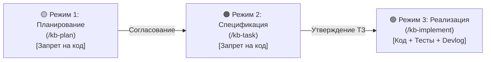

# 🚀 Руководство по онбордингу и взаимодействию (Onboarding Guide)

> **Назначение:** Единая точка входа для разработчиков и AI-агентов. Описывает архитектуру базы знаний, 3 режима разработки, правила внесения изменений и быстрые команды.
> **Связанные документы:** [[00_Index|00_Index (Карта заметок)]], [[02_Tasks/Kanban|Канбан-доска]], [[02_Tasks/Roadmap|Дорожная карта]], [[Devlog|Журнал разработки]].

---

## 1. Концепция Docs-as-Code

База знаний проекта спроектирована по методологии **Docs-as-Code** и представляет собой локальное хранилище (Vault) для **Obsidian**:
* Документация хранится в репозитории рядом с кодом в папке `docs/`.
* Все документы связаны через вики-ссылки `[[Имя_Заметки]]`.
* В начале каждого файла обязательно присутствует блок **YAML Frontmatter** (Properties).
* Принцип **Permalinks**: файлы никогда не перемещаются в `Done/` или `Archive/` во избежание Link Rot (битых ссылок). Статус меняется внутри метаданных.
* Граф связей раскрашен по категориям (`.obsidian/graph.json`).

---

## 2. Три режима взаимодействия (Operating Modes)

Работа над любой задачей или фичей строго проходит через три последовательных этапа:



### 🟡 Режим 1: Планирование (Planning / RFC)
* **Команда:** `/kb-plan <название>`
* **Цель:** Концептуальное обсуждение, Q&A, архитектурный анализ, выявление рисков.
* **🚨 ЖЕСТКИЙ ЗАПРЕТ:** **Никакого изменения рабочего кода!** Разрешено только чтение.
* **Результат:** Создается файл `docs/02_Tasks/Plans/PLAN-XXX-<slug>.md`, карточка добавляется в `Бэклог` на Канбане.

### 🟠 Режим 2: Формирование задачи (Task Specification)
* **Команда:** `/kb-task <название>`
* **Цель:** Детальное техническое задание перед написанием кода.
* **🚨 ЖЕСТКИЙ ЗАПРЕТ:** **Никакого изменения рабочего кода!**
* **Результат:** Создается файл `docs/02_Tasks/Specs/<Phase>/TASK-XXX-<slug>.md`. Фиксируются:
  - Точный список файлов: `[NEW]`, `[MODIFY]`, `[DELETE]`.
  - Контракты, сигнатуры, обработка ошибок.
  - План верификации (команды сборки, автотесты, шаги проверки).
  - Карточка переносится в `В работе` на Канбане.

### 🟢 Режим 3: Реализация и верификация (Implementation & Verification)
* **Команды:** `/kb-implement <TASK-XXX>` и `/kb-complete <TASK-XXX>`
* **Цель:** Написание кода строго по ТЗ, прогон сборки и тестов.
* **Результат:**
  1. Код написан строго по спецификации.
  2. Все пункты плана верификации успешно пройдены.
  3. Статус в ТЗ: `Выполнено`.
  4. В `Kanban.md`: карточка перенесена в `Done` с датой `(YYYY-MM-DD)`.
  5. В `Roadmap.md`: пункт отмечен `[x]` с пермалинком на ТЗ.
  6. В `Devlog.md`: добавлена запись с отчетом.

---

## 3. Быстрые команды скилла `docs-as-code`

| Команда | Описание |
| :--- | :--- |
| `/kb-init` | Первичная инициализация структуры `docs/`, шаблонов и графа в новом проекте. |
| `/kb-onboard` | Открыть или обновить этот документ онбординга. |
| `/kb-plan <name>` | Начать планирование новой фичи (Режим 1). |
| `/kb-task <name>` | Сформировать ТЗ со следующим номером `TASK-XXX` (Режим 2). |
| `/kb-implement <TASK-XXX>` | Приступить к написанию кода по ТЗ (Режим 3). |
| `/kb-complete <TASK-XXX>` | Синхронно закрыть задачу (Kanban, Roadmap, Devlog). |
| `/kb-bug <name>` | Зафиксировать сбой по шаблону `BUG-XXX` с обязательным регрессионным тестом. |
| `/kb-adr <name>` | Зафиксировать архитектурное решение `ADR-XXXX`. |
| `/kb-research <name>` | Зафиксировать исследование платформы `RESEARCH-XXX`. |
| `/kb-lint` | Запустить скрипт проверки целостности базы знаний и битых ссылок. |

---

## 4. Архитектура каталогов `docs/`

* `01_Architecture/` — Архитектурные схемы, протоколы взаимодействия, модели данных.
* `02_Tasks/` — Задачи и планирование:
  * `Kanban.md` — Оперативный трекер задач по колонкам (совместим с Obsidian Kanban).
  * `Roadmap.md` — Стратегическая дорожная карта этапов и фаз.
  * `Plans/` — Планы и RFC концепций (`PLAN-XXX`).
  * `Specs/` — Детальные ТЗ по подпапкам фаз (`TASK-XXX`).
  * `Bugs/` — Баг-репорты с RCA и регрессионными тестами (`BUG-XXX`).
* `03_Decisions_ADR/` — Архитектурные решения (`ADR-XXXX`).
* `04_Research/` — Исследования платформенных граблей и API (`RESEARCH-XXX`).
* `05_Testing/` — Реестр тестирования, чек-листы E2E UX, отчеты о прогонах.
* `00_Templates/` — Центральный каталог эталонных шаблонов для всех типов заметок.
* `Devlog.md` — Хронологический журнал разработки.
* `00_Index.md` — Карта заметок (MOC) и точка входа в хранилище.

---

## 5. Чек-лист разработчика при старте работы

- [ ] Открыть хранилище в Obsidian или IDE.
- [ ] Проверить актуальный статус на доске `docs/02_Tasks/Kanban.md`.
- [ ] Сверить текущий фокус фазы в `docs/02_Tasks/Roadmap.md`.
- [ ] Определить текущий режим работы (1, 2 или 3).
- [ ] При обнаружении бага создать `BUG-XXX` и сначала написать падающий тест (Regression-First).
- [ ] Перед отправкой изменений запустить `/kb-lint` для проверки целостности ссылок.

---

## 6. Контроль версий и синхронизация (Git & GitHub Integration)

* **Гибридная модель ветвления (Hybrid Model: Trunk-Based Docs + Feature Branches):**
  - **База знаний и планирование (`docs/`):** ведутся строго в ветке `main` как единый источник правды (Single Source of Truth). Перед началом работы всегда выполняется `git pull --rebase`.
  - **Реализация кода (`/kb-implement`):**
    - Небольшие задачи и быстрые фиксы пишутся прямо в `main` (Trunk-Based).
    - Крупные фичи и задачи при совместной разработке изолируются в ветках `feat/TASK-XXX-<slug>` и безопасно вливаются в `main` через `/kb-complete` (или через Pull Request).
* **Режим с удалённым репозиторием (GitHub / GitLab):** Если настроен `origin` (`git remote get-url origin`), все утвержденные артефакты базы знаний (планы, ТЗ, ADR, исследования, баги) и завершенные фичи автоматически фиксируются коммитами и пушатся в удаленный репозиторий.
* **Режим только локальной работы (Local-Only):** Если проект ведётся без удалённого репозитория, изменения фиксируются локальными коммитами для безопасности истории, а `git push` автоматически пропускается без ошибок.
* **Подключение к GitHub в любой момент:**
  ```powershell
  git remote add origin https://github.com/<username>/<repo>.git
  git push -u origin main
  ```
