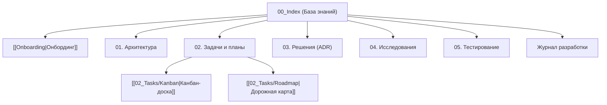

# 🧠 База знаний: agent-docs-harness

> **Теги:** #project #pkm #index #agent-docs-harness  
> **Главная спецификация:** [[../SPEC|SPEC.md (Master Specification)]]  
> **Руководство по онбордингу:** [[Onboarding|Руководство разработчика]]  

Добро пожаловать в базу знаний проекта **agent-docs-harness**. Каталог `docs/` спроектирован по методологии **Docs-as-Code** и представляет собой локальный Vault для Obsidian и любых IDE с поддержкой AI-агентов.

---

## 🗺️ Карта заметок (Map of Content)

---

## 📂 Структура разделов

### 0. Вводные материалы
* [[Onboarding|Руководство по онбордингу]] — правила ведения базы знаний, 3 режима и быстрые команды.
* [[00_Templates/TEMPLATE_TASK|Каталог шаблонов]] — эталонные шаблоны для всех типов документов (12 шаблонов).

### 1. Архитектура (`01_Architecture/`)
* Системные компоненты инсталлятора, архитектура Self-Contained сборки, кроссплатформенная абстракция.

### 2. Задачи и трекинг (`02_Tasks/`)
* [[02_Tasks/Kanban|Канбан-доска]] — оперативные задачи (Backlog, In Progress, Done).
* [[02_Tasks/Roadmap|Дорожная карта]] — стратегические фазы от MVP до релиза.
* `Plans/` — концепции и планы фичей (Режим 1).
* `Specs/` — технические задания по фазам (Режим 2).
* `Bugs/` — журнал дефектов и баг-репортов.

### 3. Архитектурные решения (`03_Decisions_ADR/`)
* [[03_Decisions_ADR/ADR-0001-zero-dependencies-python-stdlib|ADR-0001: Zero Dependencies на стандартной библиотеке Python 3]]
* [[03_Decisions_ADR/ADR-0002-self-contained-installer-bundling|ADR-0002: Монолитная сборка инсталлятора через Self-Contained Bundle]]
* [[03_Decisions_ADR/ADR-0003-multi-agent-adapter-strategy|ADR-0003: Стратегия конфигурации AI-агентов (AGENTS.md + Зеркала)]]
* [[03_Decisions_ADR/ADR-0004-multi-stack-presets-and-apple-swift-priority|ADR-0004: Мульти-стековая параметризация и приоритет Apple Swift]]

### 4. Исследования платформы (`04_Research/`)
* Исследования стандартов конфигураций агентов, особенностей CLI-терминалов, UTF-8 на Windows, pipe через curl.

### 5. Тестирование и верификация (`05_Testing/`)
* Чек-листы E2E UX, матрица тестирования инсталлятора на разных ОС и с разными стеками.

### 6. Дневник проекта
* [[Devlog|Журнал разработки]] — хроника сессий разработки и результатов.
