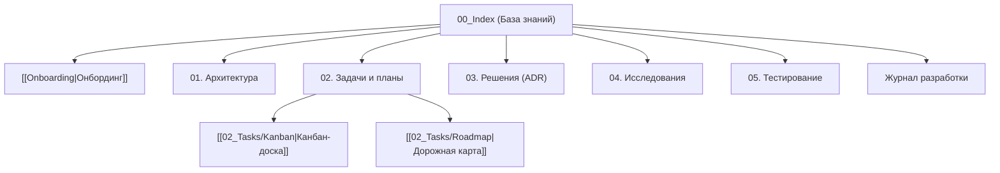

# 🧠 База знаний: agent-docs-harness

> **Теги:** #project #pkm #index #agent-docs-harness  
> **Главная спецификация:** [[../SPEC|SPEC.md (Master Specification)]]  
> **Руководство по онбордингу:** [[Onboarding|Руководство разработчика]]  

Добро пожаловать в базу знаний проекта **agent-docs-harness**. Каталог `docs/` спроектирован по методологии **Docs-as-Code** и представляет собой локальный Vault для Obsidian и любых IDE с поддержкой AI-агентов.

---

## 🗺️ Карта заметок (Map of Content)

---

## 📂 Структура разделов

### 0. Вводные материалы
* [[Onboarding|Руководство по онбордингу]] — правила ведения базы знаний, 3 режима и быстрые команды.
* [[00_Templates/TEMPLATE_TASK|Каталог шаблонов]] — эталонные шаблоны для всех типов документов (13 шаблонов, включая [[00_Templates/TEMPLATE_RELEASE|TEMPLATE_RELEASE]]).

### 1. Архитектура (`01_Architecture/`)
* Системные компоненты инсталлятора, архитектура Self-Contained сборки, кроссплатформенная абстракция.

### 2. Задачи и трекинг (`02_Tasks/`)
* [[02_Tasks/Kanban|Канбан-доска]] — оперативные задачи (Backlog, In Progress, Done).
* [[02_Tasks/Roadmap|Дорожная карта]] — стратегические фазы от MVP до релиза.
* `Plans/` — концепции и планы фичей (Режим 1).
* `Specs/` — технические задания по фазам (Режим 2).
* `Bugs/` — журнал дефектов и баг-репортов.
* `Releases/` — журнал опубликованных релизов фаз по стандарту [[00_Templates/TEMPLATE_RELEASE|TEMPLATE_RELEASE]].

### 3. Архитектурные решения (`03_Decisions_ADR/`)
* [[03_Decisions_ADR/ADR-0001-zero-dependencies-python-stdlib|ADR-0001: Zero Dependencies на стандартной библиотеке Python 3]]
* [[03_Decisions_ADR/ADR-0002-self-contained-installer-bundling|ADR-0002: Монолитная сборка инсталлятора через Self-Contained Bundle]]
* [[03_Decisions_ADR/ADR-0003-multi-agent-adapter-strategy|ADR-0003: Стратегия конфигурации AI-агентов (AGENTS.md + Зеркала)]]
* [[03_Decisions_ADR/ADR-0004-multi-stack-presets-and-apple-swift-priority|ADR-0004: Мульти-стековая параметризация и приоритет Apple Swift]]
* [[03_Decisions_ADR/ADR-0005-rejection-of-embedded-web-visualizer|ADR-0005: Отказ от встроенного веб-визуализатора базы знаний]]
* [[03_Decisions_ADR/ADR-0006-rejection-of-standalone-pdf-report-generator|ADR-0006: Отказ от отдельного генератора PDF-отчетов]]
* [[03_Decisions_ADR/ADR-0007-release-management-dual-mode-and-build-hook|ADR-0007: Архитектура релиз-менеджмента (Dual-Mode и Build Hook Contract)]]
* [[03_Decisions_ADR/ADR-0008-feedback-loops-triage-buffer-and-local-diagnostics|ADR-0008: Архитектура каналов обратной связи, буфера триажа и локальной диагностики]]
* [[03_Decisions_ADR/ADR-0009-high-snr-token-architecture-and-context-efficiency|ADR-0009: Архитектура оптимизации токенов и контекстной эффективности]]
* [[03_Decisions_ADR/ADR-0010-github-release-notes-and-public-distribution-standard|ADR-0010: Стандарт оформления публичных релизов на GitHub и экспорт Release Notes]]
* [[03_Decisions_ADR/ADR-0011-intent-routing-and-icebox-prioritization-in-kb-plan|ADR-0011: Маршрутизация намерений и приоритизация по ценности в /kb-plan]]
* [[03_Decisions_ADR/ADR-0012-discovery-mode-and-kb-research-lifecycle-integration|ADR-0012: Интеграция этапа исследования (Режим 0: Discovery) в жизненный цикл разработки]]
* [[03_Decisions_ADR/ADR-0013-zero-roundtrip-dispatch-and-hot-invariants-architecture|ADR-0013: Архитектура Zero Round-Trip Dispatch и горячие инварианты (Hot Invariants)]]
* [[03_Decisions_ADR/ADR-0014-greenfield-idea-first-initialization-and-living-spec-protocol|ADR-0014: Архитектура Greenfield-инициализации от идеи (Idea-First) и протокол Living Spec]]
* [[03_Decisions_ADR/ADR-0015-zero-to-hero-onboarding-guide-architecture|ADR-0015: Архитектура практического руководства Zero-to-Hero Onboarding Guide]]
* [[03_Decisions_ADR/ADR-0016-single-task-execution-barrier-and-stop-on-complete-protocol|ADR-0016: Барьер единичной задачи и протокол гарантированной остановки (Single-Task Barrier)]]
* [[03_Decisions_ADR/ADR-0017-release-notes-adr-exclusion-and-high-snr-standard|ADR-0017: Исключение секции архитектурных решений (ADR) из публичных релизных заметок]]
* [[03_Decisions_ADR/ADR-0018-spec-genesis-protocol-and-zero-state-handling|ADR-0018: Протокол рождения Мастер-Спецификации (Spec Genesis) и контроль Zero-State]]

### 4. Исследования платформы (`04_Research/`)
* [[04_Research/RESEARCH-001-ai-agent-ecosystem-and-ide-matrix|RESEARCH-001: Экосистема AI-агентов, сред разработки и открытых моделей]]
* [[04_Research/RESEARCH-002-release-management-and-github-automation|RESEARCH-002: Архитектура подготовки релиза (GitHub / Local-Only / Build Hooks)]]
* [[04_Research/RESEARCH-003-feedback-channels-and-triage-pipeline|RESEARCH-003: Организация каналов обратной связи и воронка триажа (GitHub vs Local-Only)]]
* [[04_Research/RESEARCH-004-token-efficiency-and-context-compression|RESEARCH-004: Оптимизация токенов и контекстная эффективность (High-SNR Token Architecture)]]
* [[04_Research/RESEARCH-005-github-release-notes-and-distribution-best-practices|RESEARCH-005: Лучшие практики оформления релизов на GitHub и автоматизация Release Notes]]
* [[04_Research/RESEARCH-006-kb-plan-icebox-prioritization-and-intent-routing|RESEARCH-006: Оптимизация точки входа планирования (/kb-plan) и маршрутизация идей из Icebox]]
* [[04_Research/RESEARCH-007-discovery-mode-and-kb-research-lifecycle-integration|RESEARCH-007: Интеграция этапа исследования (Режим 0: Discovery) и эволюция /kb-research]]
* [[04_Research/RESEARCH-008-latency-prompt-caching-and-skill-chaining|RESEARCH-008: Анализ Latency, Prompt Caching и накладных расходов скиллов в Antigravity]]
* [[04_Research/RESEARCH-009-greenfield-initialization-and-living-spec-drift|RESEARCH-009: Greenfield-инициализация от идеи (Idea-First) и Living Spec / README Sync]]
* [[04_Research/RESEARCH-010-zero-to-hero-onboarding-guide-and-developer-mental-models|RESEARCH-010: Архитектура руководства Zero-to-Hero и ментальные модели агентной разработки]]
* [[04_Research/RESEARCH-011-spec-genesis-protocol-and-zero-state-handling|RESEARCH-011: Протокол рождения Мастер-Спецификации (Spec Genesis) и контроль Zero-State]]
* [[04_Research/RESEARCH-012-single-task-execution-barrier-and-autonomous-pipeline-containment|RESEARCH-012: Барьер единичной задачи и сдерживание конвейерного перевыполнения (Autonomous Pipeline Containment)]]
* [[04_Research/RESEARCH-013-release-notes-adr-exclusion-and-high-snr|RESEARCH-013: Оптимизация публичных релизных заметок (High-SNR Release Notes)]]

### 5. Тестирование и верификация (`05_Testing/`)
* Чек-листы E2E UX, матрица тестирования инсталлятора на разных ОС и с разными стеками.

### 6. Дневник проекта
* [[Devlog|Журнал разработки]] — хроника сессий разработки и результатов.
