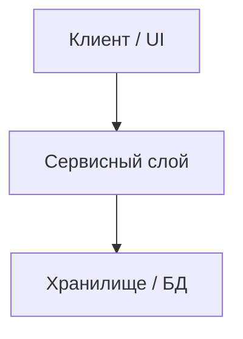

# 🏛️ Архитектура: [Название компонента]

> **Статус:** [Активно | В проектировании] | **Индекс:** [[../00_Index|00_Index]]  

---

## 1. Границы ответственности
<!-- Назначение компонента и что намеренно исключено из его зоны -->

## 2. Диаграмма взаимодействия

## 3. Интерфейсы и контракты
<!-- Ключевые классы, интерфейсы, сигнатуры методов -->

## 4. Обработка ошибок
<!-- Retry-политика, изоляция сбоев, таймауты -->
