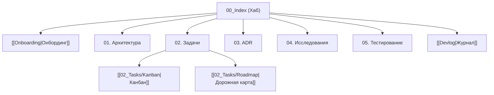

# 🧠 База знаний: [Название Проекта]

> **Спецификация:** [[../SPEC|SPEC.md]] | **Онбординг:** [[Onboarding|Онбординг]]  

---

## 🗺️ Карта разделов

---

## 📂 Разделы хранилища
* **Хабы:** [[Onboarding|Онбординг]], [[Devlog|Журнал разработки]], [[../SPEC|SPEC.md]].
* **`01_Architecture/`:** Архитектурные схемы и контракты.
* **`02_Tasks/`:** [[02_Tasks/Kanban|Канбан]], [[02_Tasks/Roadmap|Дорожная карта]], `Plans/`, `Specs/`, `Bugs/`, `Releases/`.
* **`03_Decisions_ADR/`:** Реестр решений (`ADR-XXXX`).
* **`04_Research/`:** Исследования и бенчмарки (`RESEARCH-XXX`).
* **`05_Testing/`:** Чек-листы тестирования E2E UX.
* **`00_Templates/`:** Каркасные шаблоны.
