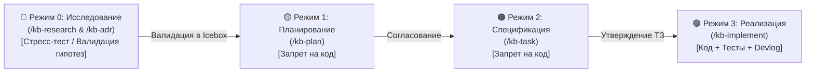

# 🛠️ Спецификация задачи: TASK-023 — Обновление шаблонов и Onboarding.md

> **ID:** TASK-023  
> **Статус:** К реализации (Режим 2)  
> **Теги:** #task/spec #phase6 #component/templates #component/docs #component/onboarding  
> **Родительский план:** [[../../Plans/PLAN-006-discovery-mode-and-kb-research-lifecycle|PLAN-006]]  
> **Связанные исследования и ADR:** [[../../../04_Research/RESEARCH-007-discovery-mode-and-kb-research-lifecycle-integration|RESEARCH-007]], [[../../../03_Decisions_ADR/ADR-0012-discovery-mode-and-kb-research-lifecycle-integration|ADR-0012]]  
> **Канбан:** [[../../Kanban|Канбан-доска]]  

---

## 1. Цель задачи

Актуализировать шаблоны базы знаний и руководство разработчика с учетом интеграции Режима 0 (Discovery & Feasibility):
1. **Синхронизация `TEMPLATE_ROADMAP.md` (в `docs/00_Templates/` и корневой `templates/`):**
   - Добавить ориентирующий комментарий в секции Icebox с рекомендацией запускать `/kb-research <идея>` вместо ручного добавления непроверенных пунктов.
   - Добавить секцию `## 🚫 Отклоненные архитектурные идеи (Rejected Alternatives)` для фиксации отказных ADR.
2. **Синхронизация `TEMPLATE_ONBOARDING.md` (в `docs/00_Templates/` и корневой `templates/`):**
   - Обновить таблицу режимов: переход на 4 режима (Режим 0: Исследование / Discovery, Режим 1: План, Режим 2: ТЗ, Режим 3: Код).
   - Актуализировать таблицу команд и шаги Brownfield Adoption.
3. **Обновление основного руководства `docs/Onboarding.md`:**
   - Обновить Mermaid диаграмму жизненного цикла (Double Diamond: Discovery + Delivery).
   - Добавить подраздел с описанием Режима 0 (Discovery & Feasibility).
   - Актуализировать сводную таблицу команд и этапов.

---

## 2. Затрагиваемые файлы и компоненты

* `[MODIFY]` `docs/00_Templates/TEMPLATE_ROADMAP.md` — стандартизация Icebox и добавление секции отклоненных альтернатив.
* `[MODIFY]` `templates/TEMPLATE_ROADMAP.md` — синхронное обновление шаблона инсталлятора.
* `[MODIFY]` `docs/00_Templates/TEMPLATE_ONBOARDING.md` — переход на 4-режимную таблицу.
* `[MODIFY]` `templates/TEMPLATE_ONBOARDING.md` — синхронное обновление шаблона инсталлятора.
* `[MODIFY]` `docs/Onboarding.md` — обновление Mermaid диаграммы и описания Режима 0.

---

## 3. Детали реализации

### Контракт `TEMPLATE_ROADMAP.md`
В конце шаблона:
```markdown
## 🔮 Перспективные направления (Future Horizons / Icebox)
*Идеи и гипотезы, промоутируемые в активные фазы через /kb-plan.*
<!-- 💡 При появлении новой идеи запустите '/kb-research <идея>', чтобы агент исследовал жизнеспособность, риски и ценность идеи (Режим 0: Discovery), оформил RESEARCH/ADR и автоматически занес валидированную инициативу в Icebox либо отклонил её. -->
* 💡 **[Инициатива]:** <!-- Краткое описание ценности и ссылки на RESEARCH/ADR -->

---

## 🚫 Отклоненные архитектурные идеи (Rejected Alternatives)
*Идеи, проанализированные в Режиме 0 или 1 и официально отклоненные для предотвращения оверинжиниринга:*
* ❌ **[Отклоненная идея]:** <!-- Причина отказа и ссылка на отказной ADR -->
```

### Контракт `TEMPLATE_ONBOARDING.md`
В разделе 2 «Режимы разработки»:
```markdown
## 2. 4 режима разработки (Discovery + Delivery)

| Режим | Триггер | Ограничение | Выход |
| :--- | :--- | :--- | :--- |
| **🔬 Режим 0: Исследование** | `/kb-research` | **READ-ONLY (Без кода)** | `RESEARCH-XXX`, `ADR`, Icebox / Отклонено |
| **🟡 Режим 1: План** | `/kb-plan` | **READ-ONLY (Без кода)** | `PLAN-XXX.md`, Канбан `📥 Бэклог` |
| **🟠 Режим 2: ТЗ** | `/kb-task` | **READ-ONLY (Без кода)** | `TASK-XXX.md`, Канбан `⏳ В работе` |
| **🟢 Режим 3: Код** | `/kb-implement` | Строго по ТЗ | Код, тесты, автозакрытие (`kb-complete`) |
```

### Контракт `docs/Onboarding.md`
Обновление диаграммы жизненного цикла:


---

## 4. План верификации (Verification Plan)

- [ ] Template Equality: убедиться, что файлы в `docs/00_Templates/` идентичны файлам в `templates/`.
- [ ] Content Check: в `docs/Onboarding.md` и шаблонах отражен 4-этапный цикл Double Diamond.
- [ ] Аудит базы знаний: запуск `python scripts/kb_lint.py --path docs` завершается с кодом 0 и 0 битых ссылок.

---

## 5. Критерии готовности (DoD)

- [ ] Все 5 целевых файлов обновлены в точном соответствии с контрактами.
- [ ] Все пункты Плана верификации пройдены.
- [ ] Статус обновлен в ТЗ (`done`), Канбане (`## ✅ Готово`) и Дорожной карте (`[x]`).
- [ ] Запись добавлена в `docs/Devlog.md`.
