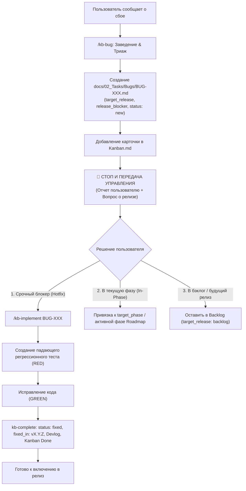

# 🔬 Исследование: RESEARCH-014 — Жизненный цикл дефектов, прозрачный триаж и релизный таргетинг

> **ID:** RESEARCH-014  
> **Статус:** Завершено | **Дата:** 2026-10-04  
> **Теги:** #research #bug-lifecycle #triage #release-targeting #token-economy #high-snr #guardrails  
> **Канбан:** [[../02_Tasks/Kanban|Канбан]]  

---

## 1. Проблема и контекст исследования

В текущей версии `agent-docs-harness` (Фазы 1–10) рабочий процесс заведения и обработки дефектов (`/kb-bug`) содержит три взаимосвязанных структурных дефекта:

1. **Своевольное немедленное исправление (Eager Bug Fixing / Auto-Fixing Runaway):**
   При вызове команды `/kb-bug <описание>` или при вербальном сообщении о найденном сбое («в модуле X падает ошибка Y») агент не только регистрирует отчет `BUG-XXX`, но и немедленно начинает исправлять исходный код, писать тесты и модифицировать кодовую базу. Разработчик лишается контроля над процессом: он не может просто зафиксировать дефект на будущее (например, находясь в середине выполнения важной задачи), не может оценить альтернативы или согласовать архитектуру исправления.
2. **Непрозрачность релизного таргетинга (Release Scoping Ambiguity):**
   Разработчик не понимает, попадет ли заведенный дефект в ближайший релиз, в текущую разрабатываемую фазу или отложен. В метаданных шаблона `TEMPLATE_BUG.md` отсутствуют поля целевого релиза/фазы (`target_release`, `target_phase`, `release_blocker`, `fixed_in`). Дефекты не отображаются в активных фазах дорожной карты (`Roadmap.md`).
3. **Хроническая кумулятивная утечка дефектов в Release Notes (Cumulative Bug Leak):**
   В утилите `scripts/kb_release.py` алгоритм сбора дефектов (`result["bugs"]`) сканирует все файлы в каталоге `docs/02_Tasks/Bugs/` и включает в чейнджлог **все** баги со статусом `fixed`/`resolved`/`done` без фильтрации по текущей версии или фазе. В результате однажды закрытый дефект (например, `BUG-001`) будет вечно дублироваться во всех будущих релизах (`v0.8.0`, `v0.9.0`, `v0.10.0`), загрязняя публичные заметки.
4. **Ограничение контекста (Token Budget Constraint):**
   Любое решение по доработке скилла `/kb-bug` должно строго следовать стандартам High-SNR (ADR-0009, ADR-0013): запрещено раздувать Always-On системный промпт и динамически загружаемый контекст многословными инструкциями и повторением шагов Режима 3.

### Проверяемые гипотезы:
* **Гипотеза 1 (Архитектурное разделение Triage vs Execution):** Разделение цикла обработки дефекта на две изолированные стадии — Заведение/Триаж (Режим 2B: `/kb-bug`) и Исправление/Верификацию (Режим 3B: `/kb-implement BUG-XXX` или специализированный легковесный `/kb-fix`) — на физическом уровне исключает Eager Auto-Fixing благодаря принципу наименьших привилегий (Principle of Least Privilege).
* **Гипотеза 2 (Сквозная трассируемость релиза через Frontmatter):** Введение атрибутов `target_release`, `target_phase`, `release_blocker` и `fixed_in` в `TEMPLATE_BUG.md` с фильтрацией в `scripts/kb_release.py` обеспечивает 100% точность релизных заметок и устраняет повторные дубли в чейнджлогах.
* **Гипотеза 3 (Сжатие контекста через Reuse):** Делегирование исправления бага существующему механизму Режима 3 (`/kb-implement BUG-XXX`) вместо дублирования процедур Git-коммитов, Devlog и верификации внутри `kb-bug` сокращает размер тела скилла `kb-bug` на 40% (с 26 до ~16 строк), уменьшая потребление контекста.

---

## 2. Анализ причин и анатомия сбоя Eager Bug Fixing

### 2.1. Почему агент сразу бросается чинить дефект?
Изучение файла `.agents/skills/kb-bug/SKILL.md` выявляет корень проблемы:
```markdown
## Procedure: Logging a Bug
1. Calculate Bug ID
2. Draft Report
3. Update Kanban
4. Git Sync (Conditional)

## Procedure: Resolving a Bug
1. Write Regression Test
2. Apply Fix
3. Update Report
4. Update Kanban & Devlog
5. Git Sync (Conditional)
```
Когда пользователь пишет: *«У нас баг в модуле X, зафиксируй»*, агент загружает `kb-bug/SKILL.md`. В агентных средах (Antigravity, Cursor, Windsurf) модель видит линейный список инструкций от начала до конца файла. Без явного барьера остановки (*Stop-on-Complete Barrier*, см. [[RESEARCH-012-single-task-execution-barrier-and-autonomous-pipeline-containment|RESEARCH-012]]) модель воспринимает раздел `Procedure: Resolving a Bug` как непосредственное продолжение работы в текущей сессии!

### 2.2. Анализ отсутствия релизного таргетинга
В `scripts/kb_release.py` строки 430–450:
```python
# 2. Bugs
bugs_dir = docs_dir / "02_Tasks" / "Bugs"
if bugs_dir.exists():
    for bug_file in sorted(bugs_dir.rglob("*.md")):
        ...
        status = fm.get("status", "").lower()
        if status in ["done", "resolved", "closed", "fixed"]:
            result["bugs"].append({...})
```
Анализ кода показывает:
- Отсутствует проверка `fixed_in` или `target_release`.
- Отсутствует проверка принадлежности к текущей релизной фазе (`target_phase`).
- Баг считается "принадлежащим релизу", если он просто лежит в папке `Bugs/` и имеет статус `fixed`.

---

## 3. Лучшие практики Docs-as-Code для баг-трекинга

На основе анализа индустриальных стандартов (GitLab Handbook, GitHub Issue Forms, Chromium Defect Lifecycle, GitOps) выделяются 4 фундаментальных принципа Docs-as-Code применительно к багам:

### Принцип 1: Разделение триажа (Triage) и исполнения (Implementation)
Заведение дефекта — это аналитическая операция (Режим 2B), цель которой — сбор минимального воспроизводимого примера (Repro Steps), стек-трейса, предварительной гипотезы первопричины (RCA) и определение критичности. Она **не должна** автоматически инициировать правку рабочего кода.

### Принцип 2: Явный релизный контракт (Explicit Release Contract)
Каждый дефект должен явно отвечать на 3 вопроса:
1. **Куда запланирован?** (`target_release: "v0.11.0"` или `target_release: "backlog"`).
2. **Блокирует ли текущий релиз?** (`release_blocker: true / false`).
3. **В какой версии фактически закрыт?** (`fixed_in: "v0.11.0"`).

### Принцип 3: Единый цикл TDD Режима 3 (Regression-First Verification)
Исправление бага — это техническая задача Режима 3. Принцип TDD:
$$\text{Failing Regression Test (RED)} \longrightarrow \text{Fix in Source (GREEN)} \longrightarrow \text{Refactor / Devlog}$$
Этот процесс идентичен обычному `/kb-implement`, но с акцентом на создание регрессионного теста. Дублировать описание коммитов, проверок и линтинга в двух разных скиллах контрпродуктивно.

### Принцип 4: Anti-Echo и Stop & Yield Control
После заведения отчета `BUG-XXX` агент обязан немедленно прекратить вызовы инструментов (Terminal Stop) и выдать структурированное резюме триажа с кнопками/командами выбора дальнейшего пути.

---

## 4. Сравнительный анализ архитектурных решений (Trade-off Matrix)

| Критерий | Вариант А: Монолитный `kb-bug` с ветвлением через флаги (`--log` vs `--fix`) | Вариант Б: Легковесный `kb-bug` (Triage Only) + Унификация Режима 3 (`/kb-implement BUG-XXX`) | Вариант В: Два скилла: `kb-bug` (Triage) + новый `kb-fix` (Resolution) |
| :--- | :--- | :--- | :--- |
| **Защита от Eager Auto-Fixing** | 🟡 Средняя (модель все еще видит шаги исправления в общем файле) | 🟢 Абсолютная (в `kb-bug` физически нет инструкций по правке кода) | 🟢 Абсолютная (инструкции разделены по разным файлам) |
| **Расход токенов (Always-On Prompt)** | 🟢 0 дополнительных токенов (1 скилл) | 🟢 0 дополнительных токенов (те же скиллы) | 🔴 +1 строка в Always-On реестр скиллов (~20 токенов) |
| **Расход токенов при вызове (On-Demand)** | 🔴 Высокий (~350 токенов, загружаются обе процедуры) | 🟢 Минимальный (~140 токенов для заведения бага, экономия 60%) | 🟢 Минимальный (~140 токенов для bug, ~150 токенов для fix) |
| **Консистентность UX** | 🟡 Требует знания флагов CLI | 🟢 Единая ментальная модель: Режим 2 специфицирует (`TASK-XXX` или `BUG-XXX`), Режим 3 исполняет (`/kb-implement`) | 🟡 Появляется дополнительная команда `/kb-fix` |
| **Сложность поддержки кода** | 🔴 Риск расхождения правил коммитов в `kb-bug` и `kb-implement` | 🟢 Максимальная (единый исполнитель Режима 3, DRY) | 🟡 Дублирование шагов финализации и проверок |
| **Вердикт** | Отклонен | **Рекомендован как основной** (с поддержкой прозрачного алиаса `/kb-fix` в документации) | Допустим как альтернатива |

---

## 5. Детальный дизайн целевого процесса

### 5.1. Жизненный цикл дефекта (State Machine)



### 5.2. Модернизация структуры метаданных (`TEMPLATE_BUG.md`)

В frontmatter добавляются обязательные атрибуты релизного планирования:

```yaml
---
id: BUG-XXX
title: "[Краткое название сбоя]"
severity: major # blocker | critical | major | minor
component:
  - core
status: new # new | investigating | confirmed | in-progress | fixed | wontfix
target_release: "v0.11.0" # "vX.Y.Z" | "hotfix" | "backlog" | "unassigned"
target_phase: 11 # номер фазы или null
release_blocker: false # true | false (блокирует ли закрытие фазы/релиза)
fixed_in: null # заполняется автоматически при фиксе ("vX.Y.Z")
regression_test: "tests/path/to/test_regression.ext"
created: 2026-10-04
updated: 2026-10-04
tags:
  - bug
kanban: "[[../Kanban|Канбан-доска]]"
---
```

### 5.3. Модернизация скилла `/kb-bug` (High-SNR Triage Protocol)

Файл `.agents/skills/kb-bug/SKILL.md` рефакторится до компактного каркаса (~18–20 строк):
1. **Только заведение и триаж:** Исключаются любые инструкции по написанию кода фикса.
2. **Интерактивный опрос/подтверждение релизного скоупа:**
   - Определение `severity` (blocker, critical, major, minor).
   - Если дефект критический (`blocker`/`critical`): выставляется `release_blocker: true` и `target_release: current`.
   - Если некритический: предлагается привязка к текущей фазе либо бэклогу.
3. **Обязательный терминальный шаг `Stop & Yield Control`:**
   Агент создает документ, обновляет Канбан, коммитит `docs(bug): log BUG-XXX <slug>` и **строго останавливает вызовы инструментов**, выводя пользователю четкие варианты действий:
   - `🚀 Исправить немедленно:` `/kb-implement BUG-XXX`
   - `📅 Запланировать в Фазу N:` подтвердить привязку к релизу
   - `📥 Оставить в бэклоге:` дефект зафиксирован, работа продолжается над основной задачей.

### 5.4. Поддержка `BUG-XXX` в `/kb-implement` (Режим 3)

В `.agents/skills/kb-implement/SKILL.md`:
- Расширяется входной параметр: `/kb-implement <TASK-XXX|BUG-XXX>`.
- Если на вход подан `BUG-XXX`:
  1. Автоматически активируется **Regression-First Principle**: первым шагом создается падающий тест из поля `regression_test` (RED).
  2. Вносится исправление в исходный код (GREEN).
  3. Вызывается авто-завершение: проставляется `status: fixed`, `fixed_in: <current_version>`, обновляется `Kanban.md` (`Done`) и `Devlog.md`.
  4. Срабатывает барьер `Stop & Yield Control`.

### 5.5. Точная фильтрация в релизном генераторе (`scripts/kb_release.py`)

В `scripts/kb_release.py` изменяется логика сбора дефектов:
```python
# Фильтрация багов для конкретного релиза target_version / target_phase:
# Баг попадает в релиз ТОЛЬКО ЕСЛИ:
# 1. status in ["fixed", "resolved", "done"]
# И
# 2. (fm.get("fixed_in") == target_version) ИЛИ 
#    (fm.get("target_phase") == target_phase и not fm.get("fixed_in"))
```
Это полностью предотвращает попадание закрытых багов прошлых версий в чейнджлоги новых фаз!

---

## 6. Отвергнутые варианты (Discarded Alternatives)

* ❌ **Оставить исправление внутри `/kb-bug` под флагом `--fix`:**
  *Причина отказа:* Языковые модели часто игнорируют тонкие семантические различия между подкомандами одного скилла, если в системном промпте присутствуют правила редактирования кода. Разделение на уровне файлов (`kb-bug` vs `kb-implement`) дает 100% гарантию надежности за счет изоляции контекста.
* ❌ **Глобальный авто-триаж без участия человека:**
  *Причина отказа:* Определение того, является ли дефект блокером текущего релиза или второстепенным багом, — прерогатива разработчика (Product Owner). Агент должен предлагать рекомендацию на основе симптомов, но не принимать решение единолично.
* ❌ **Специальный отдельный каталог `docs/02_Tasks/Bugs/Archive/`:**
  *Причина отказа:* Прямое нарушение инварианта Permalinks (No Link Rot). Статусы и принадлежность к релизу должны управляться через YAML frontmatter и скрипты сборки, без перемещения файлов по файловой системе.

---

## 7. Выводы и дорожная карта реализации

### Итоговые выводы:
1. Текущая проблема «агент заводит баг и сразу его чинит» вызвана архитектурной монолитностью `kb-bug/SKILL.md` и отсутствием терминального барьера `Stop & Yield Control`.
2. Проблема непрозрачности релизов решается добавлением метаданных `target_release`, `target_phase`, `release_blocker`, `fixed_in` в `TEMPLATE_BUG.md` и фильтрацией в `scripts/kb_release.py`.
3. Контекст не раздувается: вынос исправления в `kb-implement` уменьшает размер `kb-bug` с 26 до ~18 строк (-30%), полностью устраняя дублирование логики TDD.

### Дорожная карта внедрения (Фаза 11):
1. **Шаг 1:** Обновление шаблона `docs/00_Templates/TEMPLATE_BUG.md` (новые поля frontmatter для релизного скоупинга).
2. **Шаг 2:** Рефакторинг `.agents/skills/kb-bug/SKILL.md` (строго заведение, интерактивный триаж, остановка и предложение выбора пути).
3. **Шаг 3:** Расширение `.agents/skills/kb-implement/SKILL.md` для поддержки `BUG-XXX` (протокол Regression-First TDD).
4. **Шаг 4:** Доработка фильтрации багов в `scripts/kb_release.py` и модульные тесты в `tests/test_kb_release.py`.
5. **Шаг 5:** Синхронизация `install.py` / `build_installer.py` и сквозные E2E тесты.
