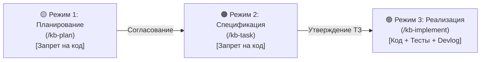

# 🚀 Руководство по онбордингу: agent-docs-harness

> **Назначение:** Единая точка входа для разработчиков и AI-агентов. Описывает архитектуру проекта, 3 режима разработки, правила внесения изменений и быстрые команды.  
> **Связанные документы:** [[00_Index|00_Index (Карта заметок)]], [[02_Tasks/Kanban|Канбан-доска]], [[02_Tasks/Roadmap|Дорожная карта]], [[Devlog|Журнал разработки]].

---

## 1. Концепция проекта

`agent-docs-harness` — это автономный инструмент (Zero Dependencies, Python 3), упаковывающий эталонную методологию **Docs-as-Code** и строгий **3-режимный процесс взаимодействия с AI-агентами** для развертывания в любых пользовательских проектах за одну команду:
```bash
curl -sSL https://raw.githubusercontent.com/<username>/agent-docs-harness/main/install.py | python3
```

Сам проект полностью следует этой же методологии (**Dogfooding**).

---

## 2. Три режима взаимодействия (Operating Modes)

Работа над любой задачей или фичей строго проходит через три последовательных этапа:



### 🟡 Режим 1: Планирование (Planning / RFC)
* **Цель:** Концептуальное обсуждение, Q&A, архитектурный анализ, выявление рисков.
* **🚨 ЖЕСТКИЙ ЗАПРЕТ:** **Никакого изменения рабочего кода!** Разрешено только чтение.
* **Результат:** Создается файл `docs/02_Tasks/Plans/PLAN-XXX-<slug>.md`, карточка добавляется в `Бэклог` на Канбане.

### 🟠 Режим 2: Формирование задачи (Task Specification)
* **Цель:** Детальное техническое задание перед написанием кода.
* **🚨 ЖЕСТКИЙ ЗАПРЕТ:** **Никакого изменения рабочего кода!**
* **Результат:** Создается файл `docs/02_Tasks/Specs/<Phase>/TASK-XXX-<slug>.md`. Фиксируются:
  - Точный список файлов: `[NEW]`, `[MODIFY]`, `[DELETE]`.
  - Контракты, сигнатуры, обработка ошибок.
  - План верификации (команды сборки, автотесты, шаги проверки).
  - Карточка переносится в `В работе` на Канбане.

### 🟢 Режим 3: Реализация и верификация (Implementation & Verification)
* **Цель:** Написание кода строго по ТЗ, прогон сборки и тестов.
* **Результат:**
  1. Код написан строго по спецификации.
  2. Все пункты плана верификации успешно пройдены.
  3. Статус в ТЗ: `Выполнено`.
  4. В `Kanban.md`: карточка перенесена в `Done` с датой `(YYYY-MM-DD)`.
  5. В `Roadmap.md`: пункт отмечен `[x]` с пермалинком на ТЗ.
  6. В `Devlog.md`: добавлена запись с отчетом.

---

## 3. Стек технологий и команды проекта

* **Язык разработки:** Python 3 (Python 3.8+) без внешних зависимостей.
* **Проверка линтером:**
  ```bash
  python scripts/kb_lint.py --path docs
  ```
* **Запуск инсталлятора локально:**
  ```bash
  python install.py --help
  python install.py --non-interactive --name "DemoProject" --stack swift --agent all --git local --target-dir test_sandbox
  ```
* **Запуск E2E тестов:**
  ```bash
  python -m unittest discover -s tests
  ```

---

## 4. Контроль версий и дисциплина Git

* Все изменения документации фиксируются коммитами в `main`.
* Принцип **Permalinks**: файлы ТЗ и багов **никогда не перемещаются** в архивные директории при закрытии.
* Принцип **Regression-First**: любой баг закрывается только при наличии теста, подтверждающего устранение сбоя.
