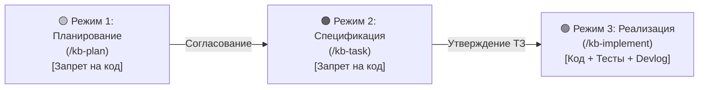

# 🚀 Руководство по онбордингу: agent-docs-harness

> **Назначение:** Единая точка входа для разработчиков и AI-агентов. Описывает архитектуру проекта, 3 режима разработки, правила внесения изменений и быстрые команды.  
> **Связанные документы:** [[00_Index|00_Index (Карта заметок)]], [[02_Tasks/Kanban|Канбан-доска]], [[02_Tasks/Roadmap|Дорожная карта]], [[Devlog|Журнал разработки]].

---

## 1. Концепция проекта

`agent-docs-harness` — это автономный инструмент (Zero Dependencies, Python 3), упаковывающий эталонную методологию **Docs-as-Code** и строгий **3-режимный процесс взаимодействия с AI-агентами** для развертывания в любых пользовательских проектах за одну команду:
```bash
curl -sSL https://raw.githubusercontent.com/koudinie101-png/agent-docs-harness/main/install.py | python3
```

Сам проект полностью следует этой же методологии (**Dogfooding**).

---

## 2. Три режима взаимодействия (Operating Modes)

Работа над любой задачей или фичей строго проходит через три последовательных этапа:



### 🟡 Режим 1: Планирование (Planning / RFC)
* **Цель:** Концептуальное обсуждение, Q&A, архитектурный анализ, выявление рисков.
* **🚨 ЖЕСТКИЙ ЗАПРЕТ:** **Никакого изменения рабочего кода!** Разрешено только чтение.
* **Результат:** Создается файл `docs/02_Tasks/Plans/PLAN-XXX-<slug>.md`, карточка добавляется в `Бэклог` на Канбане.

### 🟠 Режим 2: Формирование задачи (Task Specification)
* **Цель:** Детальное техническое задание перед написанием кода.
* **🚨 ЖЕСТКИЙ ЗАПРЕТ:** **Никакого изменения рабочего кода!**
* **Результат:** Создается файл `docs/02_Tasks/Specs/<Phase>/TASK-XXX-<slug>.md`. Фиксируются:
  - Точный список файлов: `[NEW]`, `[MODIFY]`, `[DELETE]`.
  - Контракты, сигнатуры, обработка ошибок.
  - План верификации (команды сборки, автотесты, шаги проверки).
  - Карточка переносится в `В работе` на Канбане.

### 🟢 Режим 3: Реализация и верификация (Implementation & Verification)
* **Цель:** Написание кода строго по ТЗ, прогон сборки и тестов.
* **Результат:**
  1. Код написан строго по спецификации.
  2. Все пункты плана верификации успешно пройдены.
  3. Статус в ТЗ: `Выполнено`.
  4. В `Kanban.md`: карточка перенесена в `Done` с датой `(YYYY-MM-DD)`.
  5. В `Roadmap.md`: пункт отмечен `[x]` с пермалинком на ТЗ.
  6. В `Devlog.md`: добавлена запись с отчетом.

---

## 3. Релиз-менеджмент и жизненный цикл (/kb-release)

Выпуск версий и завершение фаз проекта автоматизируется скиллом `/kb-release` и утилитой `scripts/kb_release.py`:

```
┌────────────────────────────────────────────────────────────────────────┐
│                   КАНАЛЫ ВЫПУСКА РЕЛИЗОВ (DUAL-MODE)                   │
├───────────────────────────────────┬────────────────────────────────────┤
│ 🐙 Режим GitHub (Remote Repo)     │ 💻 Локальный режим (Local-Only)    │
├───────────────────────────────────┼────────────────────────────────────┤
│ • Git remote origin настроен      │ • Локальный репозиторий / оффлайн  │
│ • Автоматический тег vX.Y.Z       │ • Без удаленного репозитория       │
│ • Публикация релиза через gh CLI  │ • Локальный архив в dist/          │
│ • GitHub Actions CI (release.yml) │ • Контрольные суммы SHA-256        │
│ • Документ в 02_Tasks/Releases/   │ • Документ в 02_Tasks/Releases/    │
└───────────────────────────────────┴────────────────────────────────────┘
```

### Регламент подготовки релиза
1. **Pre-flight проверки:**
   - Чистота рабочей копии Git (`git status`).
   - Успешный прогон тестов (`python -m unittest discover -s tests`).
   - Отсутствие битых ссылок (`python scripts/kb_lint.py --path docs`).
   - Все задачи целевой фазы закрыты в [[02_Tasks/Roadmap|Дорожной карте]].
2. **Build Hook Contract:**
   - Сборщик проекта компилирует бинарные пакеты в каталог `dist/` (например, `scripts/build_release.py`, `package.json`, `Cargo.toml`).
3. **Генерация артефактов и контрольных сумм:**
   - Расчет потоковых SHA-256 хэшей для каждого файла в `dist/`.
   - Автоматическое формирование заметки `docs/02_Tasks/Releases/RELEASE-vX.Y.Z.md` по шаблону [[00_Templates/TEMPLATE_RELEASE|TEMPLATE_RELEASE]].
4. **Синхронизация базы знаний:**
   - Отметка завершения фазы в [[02_Tasks/Roadmap|Дорожной карте]] и запись в [[Devlog|Devlog.md]].

---

## 4. Стек технологий и команды проекта

* **Язык разработки:** Python 3 (Python 3.8+) без внешних зависимостей.
* **Проверка линтером:**
  ```bash
  python scripts/kb_lint.py --path docs
  ```
* **Формирование релиза:**
  ```bash
  python scripts/kb_release.py --version vX.Y.Z --phase N
  ```
* **Запуск инсталлятора локально:**
  ```bash
  python install.py --help
  python install.py --non-interactive --name "DemoProject" --stack swift --agent all --git local --target-dir test_sandbox
  ```
* **Запуск E2E тестов:**
  ```bash
  python -m unittest discover -s tests
  ```

---

## 5. Контроль версий и дисциплина Git

* Все изменения документации фиксируются коммитами в `main`.
* Принцип **Permalinks**: файлы ТЗ и багов **никогда не перемещаются** в архивные директории при закрытии.
* Принцип **Regression-First**: любой баг закрывается только при наличии теста, подтверждающего устранение сбоя.

---

## 6. High-SNR архитектура и контекстная эффективность

Для предотвращения деградации контекста модели при длительных сессиях действует стандарт [[03_Decisions_ADR/ADR-0009-high-snr-token-architecture-and-context-efficiency|ADR-0009]]:
* **Micro-Descriptions (-53%):** Описания скиллов в YAML frontmatter сжаты до 10–13 слов, снижая постоянный налог системного реестра.
* **Progressive Disclosure Router:** Мастер-скилл `docs-as-code` работает как легковесный индекс (~2.2 КБ), раскрывая подробности по требованию.
* **Skeleton Templates (-49%):** 13 шаблонов `docs/00_Templates/` сведены к компактным каркасам с однострочными директивами `<!-- prompt -->`.
* **Anti-Echo Protocol:** Запрещена перепечатка содержимого файлов в чат — ответ содержит permalink `[File](file://...)`, 3–5 пунктов резюме и следующий шаг.
* **Silent-on-Success CLI:** Скрипты `kb_lint.py` и `kb_release.py` при успехе выводят ровно одну строку, экономя токены истории вывода.
